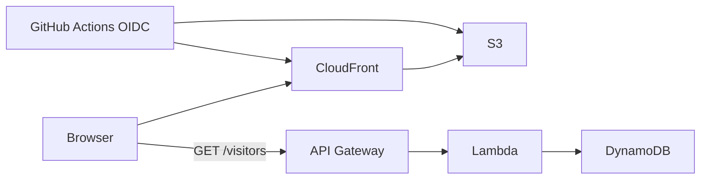

# Cloud Resume Challenge — Frontend

[](https://github.com/Bigessfour/CloudResumeChallenge-frontend/actions/workflows/ci.yml)
[](https://stephenmckitrick.com)
[](https://github.com/Bigessfour/CloudResumeChallenge-infra)
[](https://github.com/Bigessfour/CloudResumeChallenge-infra)
[](LICENSE)
[](https://www.credly.com/badges/8f01c1d2-ba98-4d09-9ffa-e424eebe18e3)

Portfolio site for the [Cloud Resume Challenge](https://cloudresumechallenge.dev/): a dark, responsive resume in **vanilla HTML/CSS/JavaScript** and **Syncfusion Essential JS 2**, hosted on private S3 + CloudFront.

**Live demo:** [https://stephenmckitrick.com](https://stephenmckitrick.com) · **Build story:** [blog.html](blog.html)

Companion repo: [CloudResumeChallenge-infra](https://github.com/Bigessfour/CloudResumeChallenge-infra)

## What this demonstrates for employers

- Production-shaped static hosting: private S3, CloudFront OAC, custom domain, security headers
- Serverless visitor counter (API Gateway + Lambda + DynamoDB) with accessible UI (`aria-live`, skeleton, count-up)
- CI + OIDC deploy — no long-lived AWS keys in GitHub
- Outcome-led portfolio narrative (municipal production site, 30% error reduction, veteran path)
- Quality gates: ESLint, Prettier, HTMLHint, structure checks

## Architecture



Full diagram and runbook: [infra ARCHITECTURE.md](https://github.com/Bigessfour/CloudResumeChallenge-infra/blob/main/docs/ARCHITECTURE.md)

## Tech stack

| Layer    | Choice                                        |
| -------- | --------------------------------------------- |
| Frontend | HTML5, CSS3, vanilla JavaScript               |
| UI       | Syncfusion EJ2 30.1.37 (CDN, Material 3 dark) |
| Quality  | ESLint, Prettier, HTMLHint, cspell            |
| CI       | GitHub Actions                                |
| Cloud    | S3, CloudFront, API Gateway, Lambda, DynamoDB |

## Quick start

```bash
git clone https://github.com/Bigessfour/CloudResumeChallenge-frontend.git
cd CloudResumeChallenge-frontend
npm ci
npm run syncfusion:provision   # local preview only; requires license key
npm run serve
```

Open [http://127.0.0.1:8000](http://127.0.0.1:8000).

## Scripts

| Command                        | Description                                                 |
| ------------------------------ | ----------------------------------------------------------- |
| `npm run serve`                | Local static server on port 8000                            |
| `npm run ci`                   | Lint + format check (matches GitHub Actions)                |
| `npm run syncfusion:provision` | Generate license files from env or `syncfusion-license.txt` |

## Roadmap

- [x] Landing page + navigation + CI pipeline
- [x] Experience section with Syncfusion Grid (Excel/PDF/Print exports all pages)
- [x] Live visitor counter (API + DynamoDB)
- [x] S3 + CloudFront + custom domain
- [x] Architecture section (challenge progress + resource inventory, collapsed by default)
- [x] Certifications & badges wall
- [x] Recruiter-first hierarchy (featured projects + progressive disclosure)
- [x] Lambda pytest suite — 7 tests, moto-mocked, gates terraform apply (CRC step 11)
- [x] Backend CI/CD — `TF_VAR_*` injection from GitHub Actions vars (CRC step 14)
- [x] Challenge blog post (CRC step 16) — [blog.html](blog.html)
- [ ] Cache-Control headers via per-pattern S3 sync (see [docs/CACHE_CONTROL_PLAN.md](docs/CACHE_CONTROL_PLAN.md))
- [ ] Light Playwright coverage for visitor counter and featured sections
- [ ] Downloadable PDF resume

## Documentation

- [blog.html](blog.html) — CRC step 16 write-up
- [docs/DEV_SETUP.md](docs/DEV_SETUP.md) — local preview, Syncfusion license, optional Cursor/MCP
- [docs/SYNCFUSION_STATIC_EJ2.md](docs/SYNCFUSION_STATIC_EJ2.md) — static EJ2 conventions
- [docs/TERRAFORM-STRUCTURE.md](docs/TERRAFORM-STRUCTURE.md) — companion infra repo layout

## Project structure

```text
├── index.html              # Resume page
├── blog.html               # CRC step 16 write-up
├── css/styles.css
├── js/app.js
├── docs/
├── .github/workflows/
├── CONTRIBUTING.md
└── LICENSE
```

IDE folders (`.cursor/`, `.trunk/`, personal `.vscode` settings) are local-only and gitignored. Contributor notes live in `docs/`.

## License

- **Code:** [MIT](LICENSE) — Copyright Stephen McKitrick
- **Syncfusion EJ2:** Requires a valid [Syncfusion license key](https://ej2.syncfusion.com/documentation/licensing/license-key-registration) for local development. Keys are never committed.

## Contributing

See [CONTRIBUTING.md](CONTRIBUTING.md). Developer tooling details: [docs/DEV_SETUP.md](docs/DEV_SETUP.md).

## Author

**Stephen McKitrick** — Veteran DevOps Engineer · Serverless · Infrastructure Automation

- GitHub: [@Bigessfour](https://github.com/Bigessfour)
