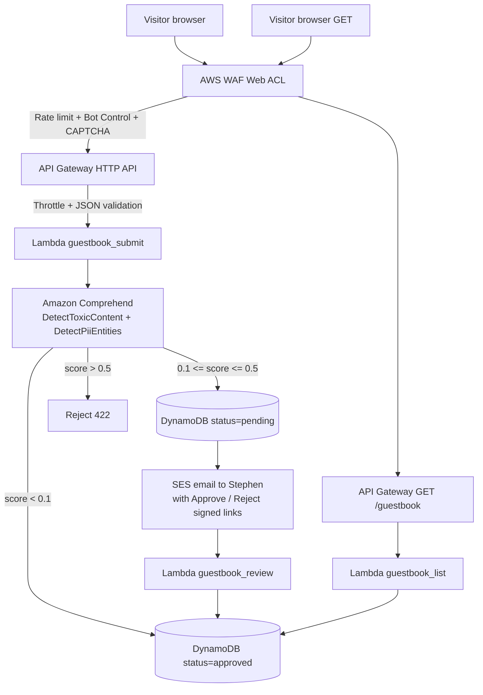
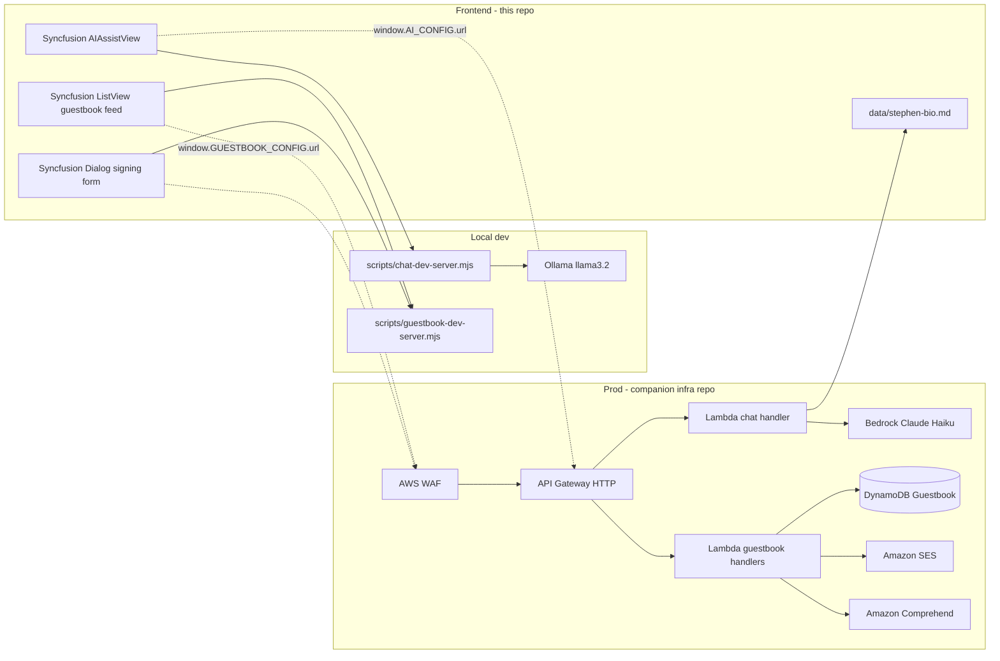

# AI Chat + Secured Guest Book — Living Plan

> **Last updated:** 2026-06-20
> **Phase:** 0 / 7 (not started — planning frozen, awaiting execution greenlight)
> **Owner:** Stephen McKitrick
> **Companion infra plan:** queued for [`Bigessfour/CloudResumeChallenge-infra`](https://github.com/Bigessfour/CloudResumeChallenge-infra)
> **Cursor execution mirror:** `.cursor/plans/ai_chat_+_secured_guest_book_*.plan.md` (auto-managed by Cursor; do not hand-edit)

This document is the source of truth for the AI chat and secured guest book features. Every decision, every task, every gotcha — captured here so any future session (you or an agent) can resume without re-litigating.

## How to resume this plan

1. **Read the Status banner + Decision log first.** Do not relitigate items already in the log.
2. **Find the first unchecked todo in Phase progress** — that is the next action.
3. **Scan Open questions.** If any are unresolved, ask before executing.
4. **Before pausing**, update the Status banner's `Last updated` and `Phase X / 7`, and append one line to the Working notes / changelog.
5. **On resume**, do step 1–3 again. If the working notes show a half-done task, finish that before starting a new one.

## Decision log

A frozen record of every answered question, the option chosen, and why. New decisions append with the date.

| Date       | Decision                             | Choice                                                                                                                             | Rationale                                                                                                                                        |
| ---------- | ------------------------------------ | ---------------------------------------------------------------------------------------------------------------------------------- | ------------------------------------------------------------------------------------------------------------------------------------------------ |
| 2026-06-20 | AI chat backend architecture         | **Hybrid: Ollama local dev + Amazon Bedrock prod**                                                                                 | Best Code Platoon AI Cloud DevOps story; pay-per-token in prod, free dev iteration                                                               |
| 2026-06-20 | Knowledge approach                   | **System-prompt injection from `data/stephen-bio.md`** (no RAG, no fine-tuning)                                                    | Bio fits in context (~3–5K tokens); deterministic; lowest cost; "I evaluated RAG and chose dense injection" is a credible architecture rationale |
| 2026-06-20 | Direct contact method                | **Promote one prominent `mailto:` Syncfusion Button**; no scheduling, no SES contact form                                          | Stephen explicitly said "merely an email will suffice"; saves SES sandbox dance                                                                  |
| 2026-06-20 | "Unique impressive" contact mechanic | **Secured guest book** (Syncfusion ListView + Dialog + AWS WAF + Comprehend + DynamoDB + SES)                                      | Recruiter-distinctive; demonstrates moderation pipeline; classic 90s pattern with modern AWS-native safety                                       |
| 2026-06-20 | Guest book moderation                | **Hybrid auto + human-in-the-loop**: auto-approve toxicity < 0.1, reject > 0.5, queue 0.1–0.5 for SES-emailed approve/reject links | Demonstrates real-world LLM-assisted moderation; Stephen retains final say without a web admin UI                                                |
| 2026-06-20 | CAPTCHA / bot defense                | **AWS WAF CAPTCHA action** (no Cloudflare Turnstile, no reCAPTCHA)                                                                 | Stays AWS-native; managed bot control rules included; single vendor surface                                                                      |
| 2026-06-20 | Plan-tracking system                 | **This file** (`docs/AI_CHAT_AND_GUESTBOOK_PLAN.md`)                                                                               | Version-controlled, GitHub-renderable, refineable across sessions, paired with auto-managed Cursor plan                                          |

## Architecture

### Security layers for the guest book



### End-to-end system



### Cost model at portfolio volume

Assumptions: ~1K page views/month, ~50 guest book submissions/month, ~100 AI chat turns/month.

| Layer                                  | Unit cost                               | Expected monthly |
| -------------------------------------- | --------------------------------------- | ---------------- |
| AWS WAF Web ACL                        | $5 base + $0.60/rule + $0.60/M requests | ~$6.50           |
| Amazon Comprehend `DetectToxicContent` | $1 / 1K requests                        | ~$0.05           |
| Amazon Comprehend `DetectPiiEntities`  | $0.0001 / unit                          | ~$0.005          |
| DynamoDB on-demand                     | $1.25 / 1M writes, $0.25 / 1M reads     | ~$0.00           |
| Lambda invocations (3 functions)       | $0.20 / 1M + $0.0000166667 / GB-second  | ~$0.00           |
| API Gateway HTTP                       | $1 / 1M requests                        | ~$0.00           |
| Bedrock Claude Haiku                   | $0.25/M in, $1.25/M out                 | ~$0.14           |
| SES                                    | $0.10 / 1K emails                       | ~$0.00           |
| CloudWatch logs + alarms               | Free tier                               | $0.00            |
| **Total**                              |                                         | **~$7.00/mo**    |

## Phase progress

Tick checkboxes as work completes. Each phase has its detailed spec further down. The order is suggested but not strict — Phase 4 (API contract doc) can be written in parallel with Phase 2 / 3 if useful.

### Phase 1 — Knowledge base + data layer

- [ ] Author `data/stephen-bio.md` (3–5K tokens) — see [Spec: Phase 1](#spec-phase-1--knowledge-base)
- [ ] Extend `js/config.example.js` with `AI_CONFIG` + `GUESTBOOK_CONFIG`

### Phase 2 — AI Chat (Syncfusion AIAssistView)

- [ ] `index.html`: add `<section id="ai-chat">` + `ej2-interactive-chat` CDN CSS/JS
- [ ] `js/app.js`: add `initAiChat()` with prompt suggestions and `promptRequest` handler
- [ ] Add `docker-compose.yml` at repo root for local Ollama
- [ ] `scripts/chat-dev-server.mjs` zero-deps proxy (reads bio.md, posts to Ollama, mirrors prod Lambda contract)

### Phase 3 — Guest book (Syncfusion ListView + Dialog)

- [ ] `index.html`: add `<section id="guestbook">` (header button + ListView mount + Dialog mount) and gated WAF SDK script
- [ ] `js/app.js`: add `initGuestbook()` with ListView read path + Dialog form write path + WAF token + Toast handling
- [ ] `css/styles.css`: Polish v4 — chat banner, guest book entries, avatars, scrollable list, reduced-motion guards
- [ ] `scripts/guestbook-dev-server.mjs` in-memory mock with seed entries

### Phase 4 — API contract documentation

- [ ] Author `docs/AI_CHAT_AND_GUESTBOOK_API.md` with full request/response shapes, Lambda flow, IAM policies, Terraform resource inventory for the infra repo

### Phase 5 — Companion infra repo plan (queued, not executed here)

- [ ] Open a follow-up planning session in `Bigessfour/CloudResumeChallenge-infra` to:
  - [ ] Add `aws_wafv2_web_acl` with managed rule sets + rate-based rule + CAPTCHA action on `/guestbook*`
  - [ ] Add `aws_wafv2_web_acl_association` to API Gateway stage
  - [ ] Add `aws_dynamodb_table` "Guestbook" with GSI1 on `status`
  - [ ] Add three `aws_lambda_function` resources (chat, guestbook_submit, guestbook_review)
  - [ ] Add four `aws_apigatewayv2_route` resources
  - [ ] Define IAM role with Bedrock + Comprehend + DynamoDB + SES least-privilege policies
  - [ ] Add `aws_ses_email_identity` with verification flow
  - [ ] Add `aws_cloudwatch_metric_alarm` for rejection-rate spike (attack signal)
  - [ ] Enable Bedrock Claude Haiku model access in the AWS Console (manual one-time)
  - [ ] Verify SES sender identity (`bigessfour@gmail.com` or a domain-verified address)

### Phase 6 — Direct email button

- [ ] Add prominent "Email Stephen" Syncfusion Button in `#contact` section with `iconCss: "e-icons e-mail-send"`
- [ ] Click handler sets `window.location.href = "mailto:bigessfour@gmail.com?subject=Hello from your portfolio"`
- [ ] Keep existing `.contact-links` mailto as secondary path

### Phase 7 — CI + docs polish

- [ ] Add `chat:dev` and `guestbook:dev` scripts to `package.json`
- [ ] Update `[docs/DEV_SETUP.md](DEV_SETUP.md)` with `docker-compose up` + dev-server workflow
- [ ] Update `[README.md](../README.md)` Roadmap with guest book + AI chat checkmarks
- [ ] Run `npx prettier --write` + `npm run ci`
- [ ] Print smoke-test instructions and a suggested commit block

---

## Detailed specs

### Spec: Phase 1 — Knowledge base

`data/stephen-bio.md` sections (hand-authored, version-controlled):

- **Identity & headline** — Wiley CO, MSG (E-8) retired, transitioning into AI Cloud DevOps.
- **Cloud certifications** — Cloud Practitioner (May 2026), AI Practitioner (June 2026), Code Platoon enrollment (2026).
- **Top projects**:
  - Cloud Resume Challenge (this site) — Syncfusion + AWS serverless + Terraform
  - BusBuddy (C# + SQL Server) — 30% error reduction in transport ops
  - Town of Wiley website — Angular on AWS Amplify
  - Wiley Widget — Blazor WASM finance workspace
  - aico-echo — Code Platoon AI Cloud capstone
- **Experience timeline** — same six entries as the existing Syncfusion Grid (Transportation Manager → Army MOS history)
- **Skills matrix** — AWS services used (S3, CloudFront, Lambda, API Gateway, DynamoDB, Bedrock, Comprehend, WAF, SES, IAM, Route 53), languages (Python, C#, JavaScript, SQL, Bash), IaC (Terraform), AI tooling (Bedrock, Ollama, Syncfusion MCP)
- **Style guide for the AI** — be concise, never invent certifications, decline questions outside the portfolio politely, always link back to the resume for verification

Single source of truth — future refactor (out of scope here): also drive the existing `experienceData` array in `js/app.js` from this file.

### Spec: Phase 2 — AI Chat

**`index.html` CDN additions** (after existing EJ2 styles):

```html
<link
  rel="stylesheet"
  href="https://cdn.syncfusion.com/ej2/30.1.37/ej2-interactive-chat/styles/material3-dark.css"
/>
<script src="https://cdn.syncfusion.com/ej2/30.1.37/ej2-interactive-chat/dist/global/ej2-interactive-chat.min.js"></script>
```

**`js/app.js` — `initAiChat()`**:

```js
new ej.interactivechat.AIAssistView({
  promptSuggestions: [
    "What is your AWS experience?",
    "Tell me about BusBuddy.",
    "What's in the Code Platoon curriculum?",
    "Walk me through the visitor counter architecture.",
  ],
  bannerTemplate: '<div class="aiav-banner">Ask Stephen anything about his portfolio…</div>',
  promptRequest: async (args) => {
    const res = await fetch(window.AI_CONFIG.url, {
      method: "POST",
      headers: { "Content-Type": "application/json" },
      body: JSON.stringify({ message: args.prompt }),
    });
    const data = await res.json();
    args.promptResult = data.reply;
  },
}).appendTo("#ai-assist-view");
```

**`docker-compose.yml`**:

```yaml
services:
  ollama:
    image: ollama/ollama:latest
    ports:
      - "11434:11434"
    volumes:
      - ~/.ollama:/root/.ollama
    restart: unless-stopped
```

First-run setup: `docker compose up -d && docker compose exec ollama ollama pull llama3.2:3b`.

**`scripts/chat-dev-server.mjs`** — zero-dep Node `http.createServer` on `:8787`. Reads `data/stephen-bio.md`, builds system prompt, POSTs to `http://127.0.0.1:11434/api/chat`, returns `{ reply, model, ts }` matching the prod Lambda contract.

### Spec: Phase 3 — Guest book

**`index.html` `<section id="guestbook">` skeleton**:

```html
<section id="guestbook" aria-labelledby="guestbook-heading">
  <p class="section-label">Guest book</p>
  <div class="guestbook-header">
    <h2 id="guestbook-heading">Sign Stephen's guest book</h2>
    <button id="sign-guestbook-btn" type="button"></button>
  </div>
  <div id="guestbook-list" aria-live="polite"></div>
  <div id="guestbook-dialog"></div>
</section>
<script defer src="<WAF_INTEGRATION_URL>/jsapi.js" id="waf-sdk"></script>
```

The WAF SDK script tag is gated — only emitted at build time / on prod via a small template substitution, or it can be appended dynamically in `js/app.js` when `GUESTBOOK_CONFIG.wafIntegrationUrl` is set.

**ListView template**:

```html
<div class="gb-entry">
  <span class="gb-avatar">${initials}</span>
  <div class="gb-body">
    <p class="gb-meta"><b>${name}</b> · <span>${role}</span> · <time>${date}</time></p>
    <p class="gb-msg">${message}</p>
  </div>
</div>
```

**Dialog form fields**:

- `TextBox` — name (max 50 chars, required)
- `TextBox` — role / company (max 80 chars, optional)
- Plain `<textarea>` or Syncfusion `RichTextEditor` in plain mode — message (max 500 chars, required)
- Submit `Button` that calls `submitGuestbookEntry()`

**Submit handler outline**:

```js
async function submitGuestbookEntry({ name, role, message }) {
  let captchaToken = null;
  if (window.AwsWafIntegration?.getToken) {
    captchaToken = await window.AwsWafIntegration.getToken();
  }
  const res = await fetch(window.GUESTBOOK_CONFIG.url, {
    method: "POST",
    headers: {
      "Content-Type": "application/json",
      ...(captchaToken && { "x-aws-waf-token": captchaToken }),
    },
    body: JSON.stringify({ name, role, message }),
  });
  if (res.status === 200) {
    showToast("Thanks! Your message is being reviewed and will appear shortly.");
  } else if (res.status === 403 || res.status === 429) {
    showToast("Slow down — please try again in a minute.", { type: "warning" });
  } else if (res.status === 422) {
    const { reason } = await res.json();
    showToast(`Rejected: ${reason}`, { type: "danger" });
  }
}
```

### Spec: Phase 4 — API contract

The contract lives in its own file (`docs/AI_CHAT_AND_GUESTBOOK_API.md`) so the infra repo can reference it directly. Summary here:

#### `POST /chat`

```http
POST /chat
Content-Type: application/json

{ "message": "What is your AWS experience?" }
```

Response 200: `{ "reply": "...", "model": "claude-3-5-haiku-20241022", "ts": 1718900000 }`

Lambda env: `BEDROCK_MODEL_ID`, `KB_PATH=/var/task/data/stephen-bio.md`. IAM: `bedrock:InvokeModel` scoped to the Haiku model ARN.

#### `POST /guestbook`

```http
POST /guestbook
Content-Type: application/json
x-aws-waf-token: <opaque>

{ "name": "Alice", "role": "Recruiter at Acme", "message": "Loved your portfolio!" }
```

Responses:

- `200 { "status": "auto_approved" | "pending_review", "id": "<uuid>" }`
- `403` — rate-limited or bot
- `422 { "status": "rejected", "reason": "toxic_content" | "pii_detected" }`

Lambda flow:

1. Validate input (name ≤ 50, message ≤ 500, role ≤ 80, all UTF-8)
2. `comprehend.detect_toxic_content` on message — reject if any score > 0.5
3. `comprehend.detect_pii_entities` on message — redact emails/phones with `[redacted]`
4. Compute status: `approved` if max toxicity < 0.1, else `pending`
5. Write to DynamoDB with PK=`GUESTBOOK`, SK=`<iso8601>#<uuid>`, attrs `name, role, message, status, ip_hash, created_at`; GSI1 on `status`
6. If `status=pending`, send SES email to Stephen with two signed URLs (approve / reject) to `guestbook_review` Lambda

#### `GET /guestbook?limit=20`

Response 200:

```json
{
  "entries": [
    {
      "id": "...",
      "name": "Alice",
      "role": "Recruiter at Acme",
      "message": "Loved your portfolio!",
      "date": "2026-06-20T20:00:00Z"
    }
  ]
}
```

Query: GSI1 where `status=approved`, sort by `created_at` desc, limit 20.

#### `GET /guestbook/review?id=...&action=approve&sig=...`

Stephen-only approval endpoint. HMAC-SHA256 signed URLs with short TTL (e.g. 7 days). Idempotent — repeated approves are no-ops.

## Open questions

Decisions still needed before or during execution. Add a row with a date; when answered, move into the Decision log and add a "Resolved on YYYY-MM-DD" suffix here before deleting on the next pass.

| Opened     | Question                                                                                                                                               | Status                                                                                               |
| ---------- | ------------------------------------------------------------------------------------------------------------------------------------------------------ | ---------------------------------------------------------------------------------------------------- |
| 2026-06-20 | Page placement: full-width sections (AI chat + guest book) vs floating action buttons vs Tabs panel                                                    | **Open** — default to full-width sections between AWS Resources and Certifications unless overridden |
| 2026-06-20 | SES verified sender: use existing `bigessfour@gmail.com` (requires verification) or stand up a domain-verified address (`hello@stephenmckitrick.com`)? | **Open** — affects how soon prod can leave SES sandbox                                               |
| 2026-06-20 | Bedrock model choice: Claude Haiku (cheapest, lowest latency) vs Claude Sonnet (smarter, ~5× cost) vs Llama via Bedrock (open-model demo angle)        | **Open** — default Haiku; can swap any time via `BEDROCK_MODEL_ID` env var                           |
| 2026-06-20 | Guest book retention: keep approved entries forever or auto-expire via DynamoDB TTL after 1 year?                                                      | **Open** — default keep forever                                                                      |
| 2026-06-20 | Rate limit values: 100 req/5min/IP for WAF, 5 req/min per IP for `POST /guestbook` at API Gateway?                                                     | **Open** — sensible defaults but worth a quick gut check                                             |

## Risks & gotchas

Documented so the next session does not get blindsided.

- **SES sandbox mode** — Out of the box SES will only send to verified addresses. Production guest-book moderation emails require either moving SES out of sandbox (24–48h support request) or always sending to a pre-verified Stephen address.
- **Bedrock model access** — Even with IAM permissions, you must enable Anthropic models in the AWS Console under Bedrock → Model Access (one-time, ~5 min). The Lambda will return `AccessDeniedException` until you do.
- **WAF cost floor** — The `$5/mo` base WAF Web ACL fee applies even at zero traffic. If you tear down the guest book later, remember to remove the WAF resource or it keeps billing.
- **AWS WAF JS SDK URL is random per Web ACL** — When the infra is provisioned, the WAF integration URL (`https://<random>.us-east-1.sdk.awswaf.com/<random>/<random>`) is exported as a Terraform output. That value must land in `js/config.js` (gitignored) at deploy time.
- **Ollama model size** — `llama3.2:3b` is the right starting point (~2 GB on disk, fits in 4 GB RAM, fast on M1+). `llama3.2:8b` is smarter but doubles RAM. `llama3.1:70b` is not viable on a laptop.
- **CORS** — Local Ollama at `127.0.0.1:11434` does not send permissive CORS by default, so the frontend cannot call it directly from `127.0.0.1:8000`. The `chat-dev-server.mjs` proxy is required (sets `Access-Control-Allow-Origin: *` for dev).
- **Comprehend regional availability** — `DetectToxicContent` is GA in `us-east-1`, `us-west-2`, `eu-west-1`, `ap-southeast-2`. If the Lambda is deployed elsewhere, fall back to per-region availability matrix in the docs.
- **DynamoDB single-table design** — Using PK=`GUESTBOOK` with sort-key timestamping puts everything in one partition. At portfolio volume this is fine; if it ever spikes, switch PK to a month bucket like `GUESTBOOK#2026-06`.
- **Syncfusion AIAssistView in CDN bundle** — `@syncfusion/ej2-interactive-chat` may not be in the default `ej2.min.js`. Confirm at execution time by checking `ej.interactivechat?.AIAssistView` after page load; if undefined, the explicit CDN script tag in Phase 2 is required (it is in the plan).

## Working notes / changelog

Reverse-chronological journal. Append a one-line entry whenever you pause, resume, or hit a decision. Format: `YYYY-MM-DD — note`.

- **2026-06-20** — Plan doc created. Frozen decisions migrated from the Cursor plan + AskQuestion history. Phase 0/7. Awaiting greenlight on the open questions listed above before execution begins.
