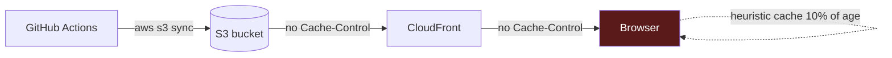
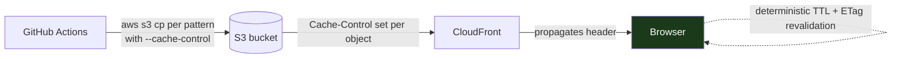
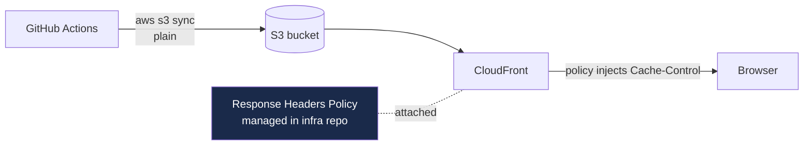

# Cache-Control Headers — Living Plan

> **Last updated:** 2026-06-20 **Phase:** 1 / 4 (deploy-time fix shipped — awaiting first prod
> smoke test on next push to `main`)
> **Owner:** Stephen McKitrick **Scope:** Frontend deploy pipeline (this repo) + optional follow-on
> in companion infra repo **Companion infra plan:** queued for
> [`Bigessfour/CloudResumeChallenge-infra`](https://github.com/BigessfourM/CloudResumeChallenge-infra)
> **Related plans:** [`docs/AI_CHAT_AND_GUESTBOOK_PLAN.md`](AI_CHAT_AND_GUESTBOOK_PLAN.md),
> [`docs/TERRAFORM-STRUCTURE.md`](TERRAFORM-STRUCTURE.md)

---

## How to resume this plan

When picking this up in a fresh chat, paste:

```
Resume the Cache-Control plan in docs/CACHE_CONTROL_PLAN.md.
Pick up at the first un-checked task in the "Phase progress" section
and continue until phase end or until you hit an open question.
Do not edit this plan file's "Decision log" or "Open questions"
sections without explicit approval — append to "Working notes /
Changelog" only.
```

The plan is the source of truth. Any agent should read the `Decision log` and `Open questions` first
before writing code.

---

## Problem statement

**Symptom (observed 2026-06-20):** after a successful Deploy workflow run + CloudFront invalidation,
the live site still appeared stale to the browser. Diagnosis confirmed:

- ✅ Files on origin (S3) are correct
- ✅ CloudFront edge cache is fresh (`age: 19` seconds, `last-modified` matches deploy timestamp)
- ❌ S3 objects are uploaded with **no `Cache-Control` header**, so CloudFront and the browser both
  fall back to **heuristic caching** (RFC 7234 §4.2.2 — typically 10% of `now - Last-Modified`)
- ❌ Browser keeps showing the previous render until heuristic TTL expires, even though `etag`
  revalidation would resolve it instantly

Evidence captured during diagnosis:

```text
$ curl -sLI https://stephenmckitrick.com/
last-modified: Sat, 20 Jun 2026 20:16:55 GMT
etag: "69bd8e6536814d80853583d415dd49b7"
x-cache: Hit from cloudfront
age: 19
# ← NO Cache-Control header
```

The `aws s3 sync` step in `.github/workflows/deploy.yml` (lines 72–92) does not set
`--cache-control`, so objects inherit no caching metadata.

---

## Goals

1. **Fast cache busts** — a fresh deploy is visible to users on next page load without needing a
   hard refresh.
2. **No degradation of perceived performance** — most assets still served from edge / browser cache
   on repeat visits.
3. **Belt-and-suspenders** — works correctly even if CloudFront invalidation is delayed or missed.
4. **Zero infra-repo dependency** for the v1 fix — implement in the deploy workflow first, leave a
   clean migration path to a CloudFront Response Headers Policy later.
5. **No bundler / build step** introduced — keep the vanilla HTML/CSS/JS workflow intact.
   Fingerprinting is a Phase 4 conversation, not a v1 requirement.

---

## Decision log

> _Append-only. Each decision freezes part of the plan. Do not rewrite — supersede with a dated
> entry below._

| #   | Decision                                                                                                                                         | Rationale                                                                                                                                                                            | Date       |
| --- | ------------------------------------------------------------------------------------------------------------------------------------------------ | ------------------------------------------------------------------------------------------------------------------------------------------------------------------------------------ | ---------- |
| 1   | Implement at **deploy time** via per-pattern `aws s3 cp --cache-control` rather than CloudFront Response Headers Policy                          | RHP requires changes in the infra repo (queued) and a redeploy of the distribution; deploy-time is owned by this repo and ships today                                                | 2026-06-20 |
| 2   | **HTML** = `no-cache, must-revalidate` (browser must always revalidate with `If-None-Match`); 304 returns are near-free                          | Matches industry pattern for un-fingerprinted SPAs (e.g. Vercel, Netlify defaults). Guarantees no stale HTML, near-zero bandwidth overhead                                           | 2026-06-20 |
| 3   | **Un-fingerprinted JS/CSS** (`js/app.js`, `js/config.js`, `js/syncfusion-license.js`, `css/styles.css`) = `public, max-age=300, must-revalidate` | 5-minute browser cache + ETag revalidation gives fast warm loads + bounded staleness. Short enough that a deploy is visible within 5 min even without a hard refresh                 | 2026-06-20 |
| 4   | **Static images** (badges, screenshots, favicons) = `public, max-age=86400, stale-while-revalidate=604800`                                       | Images change rarely; SWR lets the browser serve last copy while revalidating in the background. CloudFront invalidation covers the rare update                                      | 2026-06-20 |
| 5   | **Fonts / vendored assets** = `public, max-age=2592000, immutable` if they live in this repo at fixed paths                                      | Fonts are functionally immutable; 30-day cache + `immutable` tells the browser not to revalidate at all                                                                              | 2026-06-20 |
| 6   | Keep the existing `aws cloudfront create-invalidation --paths /*` step                                                                           | Defense in depth: even with correct Cache-Control, an invalidation forces immediate eviction at the edge for HTML changes that browsers would otherwise serve a few-hundred-ms-stale | 2026-06-20 |
| 7   | Add a **post-deploy header verification step** to the workflow                                                                                   | Catches regressions if someone adds a new file pattern without updating the cache-control sync commands                                                                              | 2026-06-20 |

---

## Caching strategy reference table

This is the authoritative mapping. Phase 1 implements it.

| Content kind         | File patterns                                                     | `Cache-Control` value                                  | Browser behavior                                         |
| -------------------- | ----------------------------------------------------------------- | ------------------------------------------------------ | -------------------------------------------------------- |
| HTML                 | `*.html` (incl. `index.html`)                                     | `no-cache, must-revalidate`                            | Revalidate every request via ETag; 304 if unchanged      |
| Un-fingerprinted JS  | `js/app.js`, `js/config.js`, `js/syncfusion-license.js`           | `public, max-age=300, must-revalidate`                 | 5 min browser cache, then revalidate                     |
| Un-fingerprinted CSS | `css/styles.css`                                                  | `public, max-age=300, must-revalidate`                 | Same as JS                                               |
| Static images        | `*.png`, `*.jpg`, `*.jpeg`, `*.gif`, `*.webp`, `*.svg`, `*.ico`   | `public, max-age=86400, stale-while-revalidate=604800` | 1-day cache; serve stale up to a week while revalidating |
| Fonts                | `*.woff`, `*.woff2`, `*.ttf`, `*.otf` (if any added later)        | `public, max-age=2592000, immutable`                   | 30-day cache, no revalidation                            |
| JSON config          | `*.json` (only if intentionally served — most are excluded today) | `public, max-age=300, must-revalidate`                 | Same as JS                                               |

---

## Architecture overview

### Today (broken)



### After Phase 1 (deploy-time fix)



### After Phase 3 (optional — CloudFront RHP via Terraform)



---

## Phase progress

### Phase 1 — Deploy-time `--cache-control` (this repo) [x]

- [x] Replace single `aws s3 sync` in `.github/workflows/deploy.yml` with a two-pass approach:
  - Pass 1: `aws s3 sync . s3://$BUCKET --delete <existing excludes>` to upload everything with
    `--delete` for orphan cleanup
  - Pass 2: per-pattern
    `aws s3 cp --recursive --metadata-directive REPLACE --cache-control <value> --exclude '*' --include '<pattern>'`
    overwrites `Cache-Control` on HTML, JS, CSS, and image extensions
- [x] Patterns cover every shipped artifact today (HTML, JS, CSS,
      `png|jpg|jpeg|gif|webp|svg|ico`)
- [x] Final verification step (`curl -sLI` for `/`, `/js/app.js`, `/css/styles.css`) fails the build
      if `Cache-Control` is empty or doesn't contain the expected directive
- [ ] Document new env vars / vars consumed in `docs/DEV_SETUP.md` (none added — used existing vars)
- [x] Update README roadmap with Phase 1 status

### Phase 2 — Smoke test in prod [ ]

- [ ] Manually trigger `Deploy` workflow via `workflow_dispatch`
- [ ] Run `curl -I` against:
  - [ ] `https://stephenmckitrick.com/`
  - [ ] `https://stephenmckitrick.com/js/app.js`
  - [ ] `https://stephenmckitrick.com/css/styles.css`
  - [ ] `https://stephenmckitrick.com/images/<a-badge>.png`
- [ ] Confirm each shows the expected `Cache-Control` value
- [ ] Open the site in a fresh browser profile and confirm DevTools → Network shows correct caching
      behavior (200 first visit, 304/from-cache on second)
- [ ] Make a trivial HTML change, redeploy, confirm new content visible without a hard refresh

### Phase 3 — (Optional) Migrate to CloudFront Response Headers Policy [ ]

> Lives mostly in the infra repo. Adds operational consistency and keeps the workflow simpler. Defer
> until the infra repo is wired up.

- [ ] In infra repo, add `aws_cloudfront_response_headers_policy` resources (one per content kind,
      or one with cache_behavior overrides keyed by path pattern)
- [ ] Attach the policy to the existing distribution's behaviors
- [ ] Once the policy is verified live, simplify the deploy workflow back to a single `aws s3 sync`
      and rely on the policy
- [ ] Remove the `--cache-control` flags from the workflow
- [ ] Keep the verification curl step — it now validates the policy instead of the sync

### Phase 4 — (Long-term, separate plan) Content fingerprinting [ ]

> Out of scope for this plan. Tracked here as a successor.

- [ ] Introduce a minimal build step (esbuild / Vite) that emits `app.[contenthash].js`,
      `styles.[contenthash].css`, and an HTML transform to update `<script>` / `<link>` references
- [ ] Switch fingerprinted assets to `public, max-age=31536000, immutable`
- [ ] Switch HTML to `no-cache` (revalidate only the entry doc)
- [ ] Delete the `--cache-control` per-pattern logic
- [ ] Update Cache-Control plan to "superseded"

---

## Detailed specifications

### S1 — `aws s3 cp` per-pattern recipe

The cleanest pattern is **sync first, overwrite metadata second**:

```bash
# Pass 1 — upload everything (existing logic, unchanged)
aws s3 sync . "s3://${S3_BUCKET}" --delete \
  --exclude ".git/*" \
  # ... all existing excludes ...

# Pass 2 — overwrite Cache-Control on each subset
# HTML — revalidate every request
aws s3 cp "s3://${S3_BUCKET}" "s3://${S3_BUCKET}" \
  --recursive --exclude "*" --include "*.html" \
  --metadata-directive REPLACE \
  --content-type "text/html; charset=utf-8" \
  --cache-control "no-cache, must-revalidate"

# JS — 5 min cache + revalidate
aws s3 cp "s3://${S3_BUCKET}" "s3://${S3_BUCKET}" \
  --recursive --exclude "*" --include "*.js" \
  --metadata-directive REPLACE \
  --content-type "application/javascript; charset=utf-8" \
  --cache-control "public, max-age=300, must-revalidate"

# CSS — 5 min cache + revalidate
aws s3 cp "s3://${S3_BUCKET}" "s3://${S3_BUCKET}" \
  --recursive --exclude "*" --include "*.css" \
  --metadata-directive REPLACE \
  --content-type "text/css; charset=utf-8" \
  --cache-control "public, max-age=300, must-revalidate"

# Images — 1 day + SWR
for ext in png jpg jpeg gif webp svg ico; do
  aws s3 cp "s3://${S3_BUCKET}" "s3://${S3_BUCKET}" \
    --recursive --exclude "*" --include "*.${ext}" \
    --metadata-directive REPLACE \
    --cache-control "public, max-age=86400, stale-while-revalidate=604800"
done
```

Notes:

- `--metadata-directive REPLACE` is required when copying objects in place; without it, S3 preserves
  the original metadata.
- We set `--content-type` explicitly for HTML/JS/CSS because the in-place copy can otherwise
  downgrade to `application/octet-stream`. Image MIME types are detected from the extension and
  don't need a forced content type — but if regressions appear, add one.
- Subsequent passes do not transfer object bodies — S3 supports in-place metadata updates as a
  server-side copy, so these calls are fast (~ms per object).

### S2 — Verification step

Add as the **last** step of `deploy.yml`, after the invalidation:

```yaml
- name: Verify Cache-Control headers
  run: |
    set -euo pipefail
    HOST="https://stephenmckitrick.com"

    check() {
      local path="$1"
      local must_contain="$2"
      local actual
      actual=$(curl -sLI "${HOST}${path}" | tr -d '\r' | awk -F': ' 'tolower($1)=="cache-control"{print $2}')
      if [[ -z "$actual" ]]; then
        echo "::error ::Missing Cache-Control on ${path}"
        return 1
      fi
      if [[ "$actual" != *"$must_contain"* ]]; then
        echo "::error ::Unexpected Cache-Control on ${path}: '${actual}' (expected to contain '${must_contain}')"
        return 1
      fi
      echo "OK ${path} → ${actual}"
    }

    # CloudFront edge may take a few seconds to reflect the invalidation
    sleep 10

    check "/" "no-cache"
    check "/js/app.js" "max-age=300"
    check "/css/styles.css" "max-age=300"
```

Image check is optional — extending to one badge URL is fine.

### S3 — Rollback plan

If the new headers cause an unexpected regression (e.g. a CDN behavior we forgot about, or a
downstream tool that breaks on `must-revalidate`):

1. Revert `deploy.yml` to the previous single `aws s3 sync` step
2. Re-run `Deploy` — S3 objects will revert to no `Cache-Control`
3. Run `aws cloudfront create-invalidation --paths '/*'` manually
4. Open an issue, capture the regression, iterate

---

## Open questions

> _Mark resolved questions with their answer and migrate them into the Decision log above._

1. **Image cache TTL** — is 1 day with SWR the right balance, or bump to 7 days? Bias is toward 1
   day given how active the site currently is.
2. **JSON files** — are any user-facing JSON files actually served? Inventory before Phase 1 closes.
3. **Verification reach** — should the verify step also check `js/config.js` and
   `js/syncfusion-license.js`? Probably yes, but confirm they're publicly readable in the path order
   CloudFront uses.
4. **Failure policy** — should the verification step `exit 1` (fail the workflow) or
   `echo ::warning` only? Bias toward `exit 1` for the first pass to catch regressions loudly.
5. **Cross-region** — site is `us-east-1` only today, so no concern. Revisit if multi-region
   distribution is added.

---

## Risks & gotchas

- **S3 in-place copy preserves ACLs but resets storage class** — not a concern for Standard, but
  flag if we ever move to IT or IA.
- **`--metadata-directive REPLACE` with no `--content-type` flag** can reset the MIME type to a
  default. Always pair them when the content-type matters (HTML/JS/CSS especially).
- **`stale-while-revalidate` is not honored by all proxies** — that's fine, they'll fall through to
  the `max-age` portion.
- **CloudFront default cache behavior may override headers** if the cache policy is
  "CachingOptimized" (which strips Cache-Control on origin response). Check the cache policy in the
  AWS console **before** Phase 1 deploy. The fix: switch to "UseOriginCacheControlHeaders" or
  "CachingDisabled" cache policy for HTML if needed.
- **CSS / JS revalidation on every page** sounds expensive but is a 304 with empty body — typically
  < 1 KB and < 50 ms.

---

## Working notes / Changelog

> _Append-only. Use ISO dates. Brief is fine._

- **2026-06-20** — Plan created. Triggered by stale-browser diagnosis on prod. Frozen at Phase 0
  pending greenlight.
- **2026-06-20** — Phase 1 shipped: two-pass S3 deploy (sync bodies, then `aws s3 cp` per pattern
  to set `Cache-Control`) + curl verification step. Awaiting first prod run on next push to
  confirm headers reach CloudFront edge.
